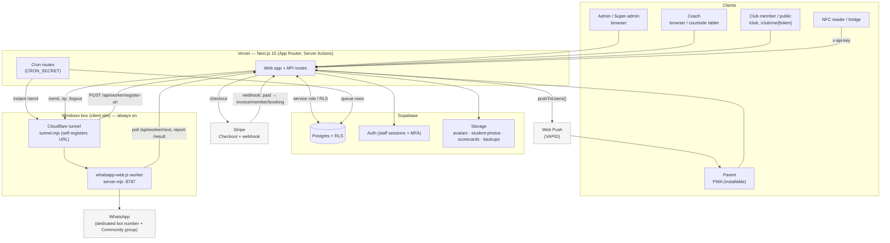

# HBA — Architecture & Data Model

Companion to [`../HANDOVER.md`](../HANDOVER.md). Two diagrams: the runtime system
and the database schema. Both are **Mermaid** — GitHub renders them inline; edit
the text to keep them current.

---

## 1. System architecture

How the pieces talk at runtime. The app is stateless on Vercel; the only
long-lived process is the WhatsApp worker on a separate Windows box.

**Read it as:** every client hits the Vercel app. The app owns all data access
(staff via RLS, parents/club/cron/webhooks via the service-role key). Cron only
*queues* WhatsApp; the **worker** is what actually sends, over a Cloudflare tunnel
whose URL it re-registers to the DB on every restart. If that box is down,
messages pile up queued — nothing else breaks.

---

## 2. Database schema (ER diagram)

Real foreign keys from `supabase/migrations/*`. `profiles` (every user),
`students`, `sessions`, and `invoices` are the hubs. `auth.users` is Supabase's
own table (`profiles.id` = `auth.users.id`). Dead/legacy tables are marked.

```mermaid
erDiagram
    branches   ||--o{ profiles   : branch_id
    branches   ||--o{ students   : branch_id
    branches   ||--o{ classes    : branch_id
    branches   ||--o{ sessions   : branch_id
    branches   ||--o{ invoices   : branch_id

    profiles   ||--o{ students   : "parent_id / coach_id"
    profiles   ||--o{ classes    : "coach_id (primary)"
    classes    ||--o{ class_coaches : class_id
    profiles   ||--o{ class_coaches : coach_id
    classes    ||--o{ class_schedules : class_id
    classes    ||--o{ enrollments : class_id
    students   ||--o{ enrollments : student_id
    classes    ||--o{ sessions   : class_id
    class_schedules ||--o{ sessions : schedule_id

    sessions   ||--o{ attendance : session_id
    students   ||--o{ attendance : student_id
    sessions   ||--o{ nfc_tap_events : session_id
    students   ||--o{ nfc_tap_events : student_id
    sessions   ||--o{ coach_checkins : session_id
    profiles   ||--o{ coach_checkins : coach_id

    sessions   ||--o{ leave_requests : "session_id / makeup_session_id"
    students   ||--o{ leave_requests : student_id
    profiles   ||--o{ leave_requests : "parent_id / decided_by"
    sessions   ||--o{ coach_leave_requests : session_id
    profiles   ||--o{ coach_leave_requests : "coach_id / decided_by"

    students   ||--o{ session_marks : student_id
    sessions   ||--o{ session_marks : session_id
    profiles   ||--o{ session_marks : coach_id
    students   ||--o{ monthly_assessments : student_id
    classes    ||--o{ monthly_assessments : class_id
    profiles   ||--o{ monthly_assessments : coach_id
    students   ||--o{ session_notes : student_id
    students   ||--o{ level_exams : student_id
    profiles   ||--o{ level_exams : coach_id
    students   ||--o{ skill_mastery : student_id
    students   ||--o{ rank_events : student_id
    profiles   ||--o{ rank_events : changed_by

    fee_plans  ||--o{ invoices   : fee_plan_id
    students   ||--o{ invoices   : student_id
    profiles   ||--o{ invoices   : parent_id
    invoices   ||--o{ payments   : invoice_id
    invoices   ||--o{ message_queue : invoice_id
    profiles   ||--o{ message_queue : recipient
    students   ||--o{ reward_ledger : student_id
    reward_rules ||--o{ reward_ledger : rule_id
    profiles   ||--o{ coach_pay   : coach_id

    profiles   ||--o{ push_subscriptions : user_id
    profiles   ||--o{ notifications : recipient
    profiles   ||--o{ parent_login_tokens : profile_id

    club_members ||--o{ invoices : club_member_id
    fee_plans    ||--o{ club_members : "tier_id"
    profiles     ||--o{ club_members : profile_id
    branches     ||--o{ club_members : branch_id
    courts       ||--o{ court_bookings : court_id
    club_members ||--o{ court_bookings : club_member_id
    invoices     ||--o{ court_bookings : invoice_id
    courts       ||--o{ court_rentals : court_id

    marking_schemes ||--o{ marking_criteria : scheme_id
    assessments  ||--o{ assessment_scores : assessment_id
    students     ||--o{ scorecards : "student_id (legacy)"
```

### Table roles (quick legend)

| Domain | Tables |
|--------|--------|
| Identity / org | `branches`, `profiles`, `students`, `push_subscriptions`, `notifications`, `parent_login_tokens`, `mfa_backup_codes` |
| Classes | `classes`, `class_coaches`, `class_schedules`, `enrollments`, `sessions`, `school_holidays`, `public_holidays` |
| Attendance | `attendance`, `nfc_tap_events`, `coach_checkins`, `leave_requests`, `coach_leave_requests` |
| Progress | `session_marks`, `monthly_assessments`, `session_notes`, `level_exams`, `skill_mastery`, `rank_events` |
| Billing | `fee_plans`, `invoices`, `payments`, `coach_pay`, `message_queue` |
| Rewards | `reward_rules`, `reward_ledger` (engine parked) |
| Messaging / config | `messages`, `app_settings` |
| Club business | `club_members`, `courts`, `court_rentals`, `court_bookings` |
| **Dead / legacy** | `marking_schemes`, `marking_criteria`, `assessments`, `assessment_scores`, `weekly_marks`, `scorecards` |

> Legacy tables are unused by current features but retained (no destructive drop).
> The live progress pipeline is `session_marks` + `monthly_assessments` +
> `level_exams`, **not** the old `assessments`/`scorecards` path.
